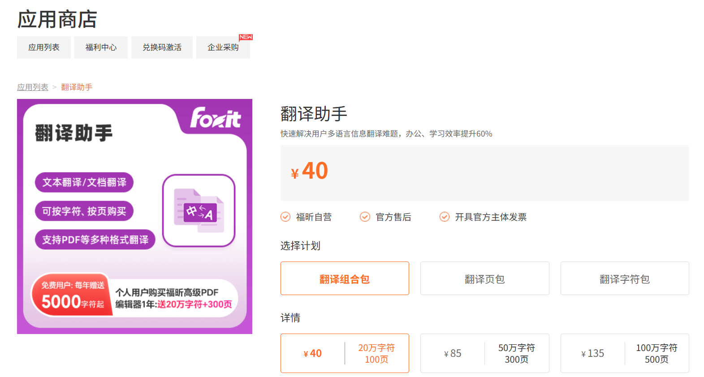

# LTT / A long-text translation tool based on DeepSeek API, designed for academic papers (PDF).

> To address the inefficiencies of frequent API calls and the high cost of professional software in large-scale translation scenarios, I have developed an automated tool. This tool automatically orchestrates large language model APIs, merges multiple outputs into a single `.docx` document, and operates seamlessly in the background — significantly reducing manual effort.

---

## Features 

| 功能 | 说明 |
|------|------|
| **自动调度接口** | 无需人工干预，自动调用大模型接口 |
| **多轮结果合并** | 将多次翻译输出合并为一份结构清晰的 `.docx` 文档 |
| **后台静默运行** | 以静默后台方式运行，不影响其他工作流程 |
| **高性价比** | 降低对昂贵专业翻译软件的依赖，显著节约成本 |

---
传统专业翻译软件（如福昕阅读器）按页收费，价格高达 **0.4 元/页**，而本工具通过调用大模型API，单页翻译成本仅需 **0.02 元/页**，成本仅为前者的 **1/20**，降幅高达 **95%**！

## Supported Models 

- DeepSeek
- *更多模型持续接入中...*

---

## Quick Start 

### Environment
